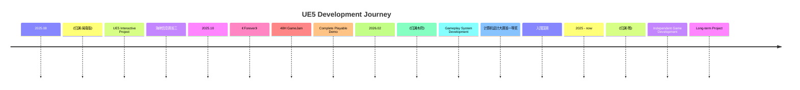
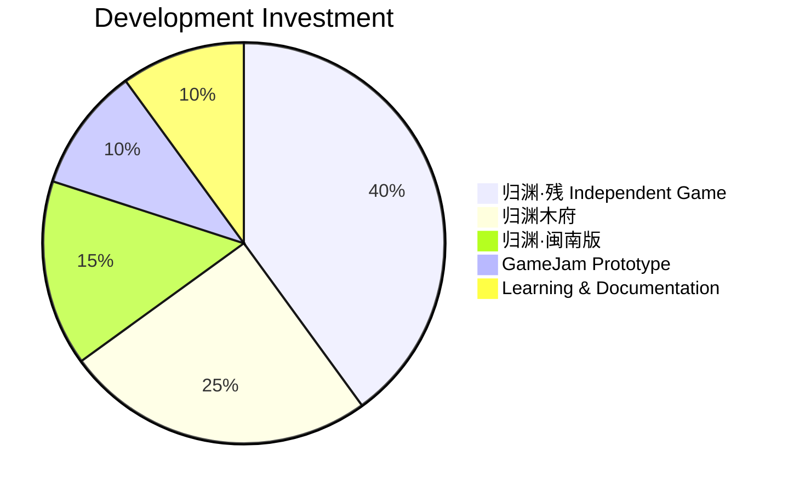

<div align="center">

# 周玥 · Zhou Yue

### UE5 Technical Designer

**Building Gameplay Systems with Unreal Engine 5**

</div>

<p align="center">
  
  
  
  
  
</p>

---

## 01 Developer Identity

<table align="center">
<tr>
<td width="33%" align="center">

### 🎮 Focus
**Gameplay System**
**System Design**

</td>
<td width="33%" align="center">

### ⚙ Engine
**Unreal Engine 5**
**Blueprint & C++**

</td>
<td width="33%" align="center">

### 📌 Role
**Technical Designer**
**Gameplay Programmer**

</td>
</tr>
</table>

---

## 02 Development Timeline



---

## 03 Development Focus Distribution



---

## 04 Role Capability

| Responsibility | Level |
| :--- | :--- |
| Gameplay Programming | ██████████ 100% |
| Blueprint Architecture | █████████░ 90% |
| System Design | ████████░░ 80% |
| Technical Planning | ████████░░ 80% |
| Game Design | ███████░░░ 70% |
| Team Collaboration | ██████░░░░ 60% |

---

## 05 Technical Stack

```
ENGINE
─────────────────────────────────────────
  UE5                      ██████████
  Blueprint                ██████████
  C++                      ███████░░░

GAMEPLAY
─────────────────────────────────────────
  Character Controller     ████████░░
  AI Behavior System       ███████░░░
  Save System              ████████░░
  State Machine            ████████░░

DESIGN
─────────────────────────────────────────
  Technical Documentation  ████████░░
  Data Driven Design       ███████░░░
  System Architecture      ████████░░

TOOLS
─────────────────────────────────────────
  Git                      ██████░░░░
  Blender                  ████░░░░░░
  Perforce                 ████░░░░░░
```

---

## 06 Achievement Timeline

<table>
<tr>
<td width="50%" valign="top">

### 🏆 2026

**🥇 中国计算机设计大赛 · 省一等奖**

《归渊木府》

*UE5 叙事玩法系统设计*

入围国赛

</td>
<td width="50%" valign="top">

### 🏅 2025

**🥉 海峡信息赛 · 省三等奖**

《归渊·闽南版》

*UE5 交互系统开发*

**🎮 48H GameJam · Complete Demo**

《Forever》

*Solo Developer*

</td>
</tr>
</table>

---

## 07 Featured Projects

<table>
<tr>
<td width="33%" valign="top">

### 🎮 归渊木府

**UE5 叙事玩法项目**

Role: Technical Designer

* Gameplay System
* Save System
* Dialogue System

→ View Repository

</td>
<td width="33%" valign="top">

### 🎮 归渊·闽南版

**交互系统项目**

Role: Gameplay Programmer

* Interaction System
* UI Framework
* Level Blueprint

→ View Repository

</td>
<td width="33%" valign="top">

### 🎮 Forever

**48H GameJam 原型**

Role: Solo Developer

* Complete Playable Demo
* Core Mechanic
* Full Pipeline

→ View Repository

</td>
</tr>
</table>

---

## 08 Contact

<p align="center">
  <a href="https://github.com/zhouy8661-prog/UE5-Tech-Design"></a>
  <a href="https://github.com/zhouy8661-prog/portfolio"></a>
</p>

<p align="center">
  <a href="https://github.com/zhouy8661-prog"></a>
  
  
</p>

<div align="center">

**"I build gameplay systems with UE5."**

</div>
